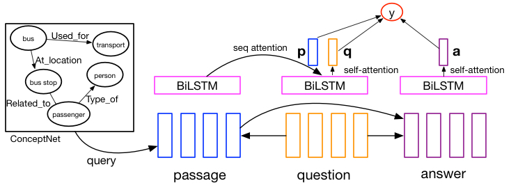

## SemEval 2018 task 11: [Machine Comprehension using Commonsense Knowledge](https://competitions.codalab.org/competitions/17184)

## Model Overview

We use attention-based LSTM networks.

For more technical details,
please refer to our paper at [https://arxiv.org/abs/1803.00191](https://arxiv.org/abs/1803.00191)

The overall model architecture is shown below:

## How to run

### Prerequisite

pytorch >= 0.2

spacy >= 2.0

GPU machine is preferred.

### Step 1: 
Download preprocessed data from [Google Drive](https://drive.google.com/open?id=1M1saVYk-4Xh0Y0Ok6e8liDLnElnGc0P4) or [Baidu Cloud Disk](https://pan.baidu.com/s/1kWHj2z9), unzip and put them under folder data/.
 
If you choose to preprocess dataset by yourself, 
please preprocess official dataset by `python3 src/preprocess.py`, download [Glove embeddings](http://nlp.stanford.edu/data/glove.840B.300d.zip), 
and also remember to download [ConceptNet](https://github.com/commonsense/conceptnet5/wiki/Downloads) and preprocess it with `python3 src/preprocess.py conceptnet`

Official dataset can be downloaded on [hidrive](https://my.hidrive.com/lnk/DhAhE8B5).

We transform original XML format data to Json format with [xml2json](https://github.com/hay/xml2json) by running `./xml2json.py --pretty --strip_text -t xml2json -o test-data.json test-data.xml`

### Step 2:

Train model with `python3 src/main.py --gpu 0`,
the accuracy on development set will be approximately 83% after 50 epochs.

## How to replicate our competition results

Following above instructions you will get a model with ~81.5% accuracy on test set,
we use two additional techniques for our official submission (~83.95% accuracy):

1. Pretrain our model with [RACE dataset](http://www.cs.cmu.edu/~glai1/data/race/) for 10 epochs.

2. Train 9 models with different random seeds and ensemble their outputs.